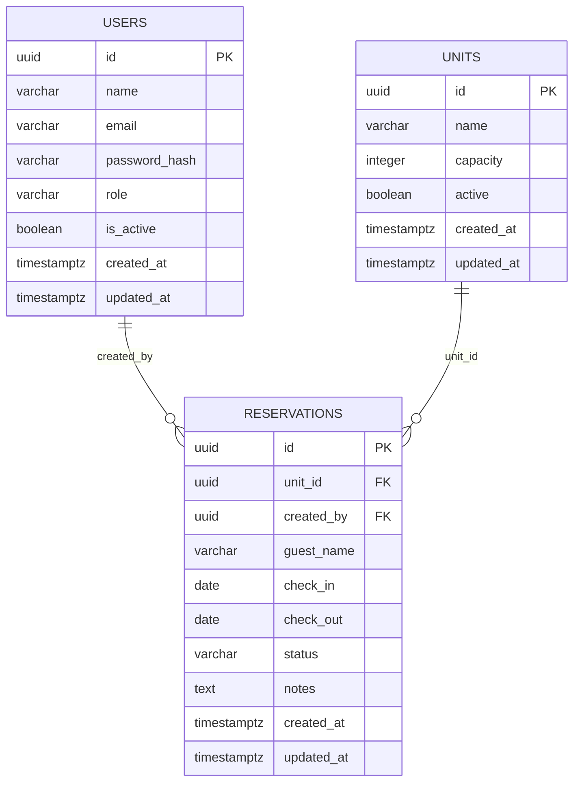

# <NOME_DO_PROJETO> — Esquema de Base de Dados

Descrição do modelo relacional em PostgreSQL para suportar autenticação, gestão de unidades e reservas internas.

## Tabelas

### users
- **id**: `uuid`, PK, not null
- **name**: `varchar(150)`, not null
- **email**: `varchar(180)`, not null, único
- **password_hash**: `varchar(255)`, not null
- **role**: `varchar(50)`, not null (ex.: `admin`, `agent`)
- **is_active**: `boolean`, not null, default `true`
- **created_at**: `timestamp with time zone`, not null, default `now()`
- **updated_at**: `timestamp with time zone`, not null, default `now()`

### units
- **id**: `uuid`, PK, not null
- **name**: `varchar(150)`, not null
- **capacity**: `integer`, not null
- **active**: `boolean`, not null, default `true`
- **created_at**: `timestamp with time zone`, not null, default `now()`
- **updated_at**: `timestamp with time zone`, not null, default `now()`

### reservations
- **id**: `uuid`, PK, not null
- **unit_id**: `uuid`, FK → `units.id`, not null
- **created_by**: `uuid`, FK → `users.id`, not null
- **guest_name**: `varchar(150)`, not null
- **check_in**: `date`, not null
- **check_out**: `date`, not null
- **status**: `varchar(30)`, not null (ex.: `confirmed`, `pending`, `cancelled`)
- **notes**: `text`, nullable
- **created_at**: `timestamp with time zone`, not null, default `now()`
- **updated_at**: `timestamp with time zone`, not null, default `now()`

## Relações
- `reservations.unit_id` referencia `units.id` (N:1) — uma reserva pertence a uma unidade.
- `reservations.created_by` referencia `users.id` (N:1) — registo de quem criou ou atualizou a reserva.

## Diagrama ER (Mermaid)

